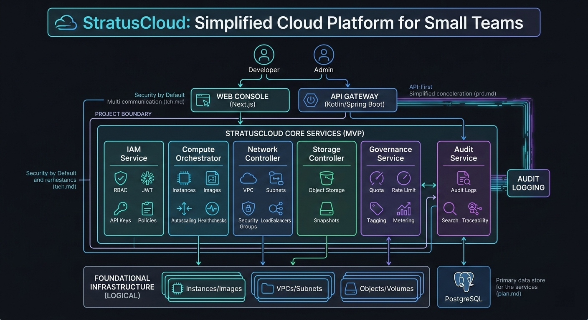

# StratusCloud

StratusCloud는 개인/소규모 팀을 위한 셀프서비스 클라우드 플랫폼 프로젝트입니다.



## 디렉토리 구조

- `backend`: Kotlin + Spring Boot 멀티모듈 API 서버
- `frontend`: Next.js 기반 운영 콘솔
- `contracts`: OpenAPI 계약 문서

## 빠른 시작

### Backend

```bash
cd backend
docker compose -f docker-compose.local.yml up -d --build
./gradlew clean test
./gradlew :apps:api:bootRun
```

로컬 의존성 설정과 인증 예시는 [backend/README.md](backend/README.md)를 참고한다.

### Frontend

```bash
cd frontend
npm install
npm run dev
```
